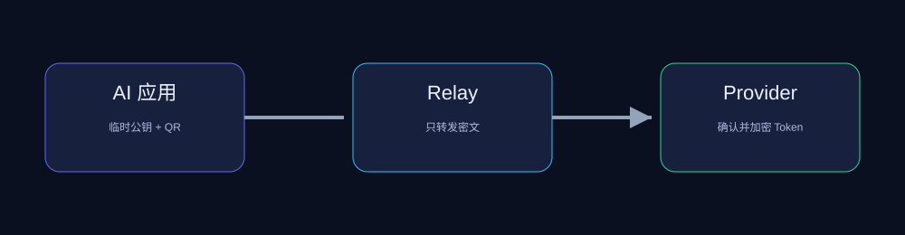

# TokenQR

> **不要再复制粘贴 Token。扫描、确认、授权。**

TokenQR 是一个开放的、客户端优先的 Token 授权协议：电脑上的 AI 应用显示一个一次性二维码，用户在自己的 Provider 页面中确认授权，Token 使用电脑端临时公钥加密后经 Relay 传递，只有发起授权的应用能够解密。

本仓库的网页只是一个 POC。更重要的是协议本身：任何应用、Provider、Relay 或 Gateway 都可以实现它，而不必把用户锁定在某个云服务里。



## 为什么需要 TokenQR？

AI 应用越来越多，但 Token 的供应方式仍然停留在复制粘贴：从 Provider 控制台复制 Secret，经过剪贴板、聊天软件、截图或手工配置，再粘贴进另一个应用。这个过程既不安全，也不便于用户理解“哪个应用正在使用我的 Token”。

TokenQR 把这件事变成一个可解释的授权动作：

1. 应用说明自己是谁、为什么需要 Token；
2. 用户在自己的 Provider 页面选择凭据和模型；
3. 用户确认授权期限以及策略意图；
4. Token 端到端加密传给请求方；
5. Relay 只负责转发，不需要理解或保存 Token。

这不是另一个 Token 云服务，也不是强迫所有人使用同一个供应商。它是一条开放的“Token 授权管道”，让本地应用、开源工具、桌面软件和未来的 Gateway 可以共享一种简单的交互协议。

## 协议哲学

- **Provider 自主**：用户的 Token 留在自己的 Provider 配置中，授权对象由用户选择。
- **客户端优先**：基础协议不要求注册账号、绑定银行卡或部署中心云服务。
- **Relay 可替换**：公共 Relay、本地 Relay、企业 Relay 或自建服务都可以实现同一接口。
- **端到端保密**：Relay 看不到授权 Token；二维码也不携带 Token。
- **策略诚实表达**：限流、限量、模型白名单只有 Provider 或可选 Gateway 支持时才能强制执行，协议不伪装客户端约定。
- **开放互操作**：MIT License，协议文档公开，任何人都可以实现兼容客户端或服务。

## 当前 POC

当前实现是一个单文件网页 `tokenqr.html`，包含：

- 电脑端和 Provider 端两个 Tab；
- 多 Provider 本地配置；
- `/models` 自动拉取及手动 fallback；
- 二维码生成和摄像头扫描；
- P-256 ECDH + HKDF + AES-GCM；
- 授权确认界面；
- 有效期、模型、限流和限量的策略展示；
- 本地 Python Relay；
- 授权成功后的极简 OpenAI-compatible 聊天界面。

## 快速开始

终端一：

```bash
python3 server.py
```

终端二：

```bash
python3 -m http.server 8080
```

浏览器打开：`http://localhost:8080/tokenqr.html`。打开两个 Tab：一个选择“电脑端应用”，另一个选择“Provider 手机端”。Provider 配置保存在当前浏览器的 Local Storage 中。

本地 Relay 默认地址：

```text
http://localhost:8765/relay
```

## Relay 为什么不直接绑定某一家？

Relay 只需要提供一次性消息邮箱。公共服务经常有 CORS、匿名额度、保留时间或 API 变更问题，因此 TokenQR 把 Relay 做成可替换 Adapter。POC 使用标准库 Python Server，生产环境可以替换成任意支持 HTTPS、CORS、随机 endpoint 和一次性消费的实现。

## 可选 Gateway

基础模式直接把 Provider Token 交给本地应用，这是协议的最小闭环。未来可以使用 LiteLLM 等成熟 Gateway，把 TokenQR 授权转换成 Gateway Key，从而获得强制模型限制、RPM/TPM、预算和撤销能力。Gateway 是可选扩展，不是基础协议依赖。

## 安全边界

TokenQR 解决传输链路和授权交互中的复制粘贴泄露问题，不保护已经被攻破的电脑、恶意浏览器扩展或已经获得解密后 Token 的应用。Provider 是否真正撤销或过期，仍由 Provider 自己决定。

不要在公开环境使用长期生产 Token。详见 [SECURITY.md](SECURITY.md) 和 [协议草案](docs/protocol.md)。

## 路线图

- [x] 单文件网页 POC
- [x] 多 Provider 配置
- [x] 本地 Relay
- [x] 端到端加密授权
- [ ] 公共 Relay Adapter
- [ ] Provider 模型列表缓存和编辑
- [ ] LiteLLM 等 Gateway 适配
- [ ] 独立协议实现和互操作测试

## 参与协议建设

欢迎提交 Issue、Relay Adapter、Provider 适配器和安全审查。请先阅读 [CONTRIBUTING.md](CONTRIBUTING.md)。本项目采用 MIT License，目标是让 Token 授权成为所有 AI 应用都能使用的开放基础设施。

## License

[MIT](LICENSE)
